# Webprogramozás 1 – Előadás Beadandó

## Dokumentáció

**Készítette:** Peti352
**Neptun kód:** `GULX05`
**Oktató:** Dr. Subecz Zoltán
**Intézmény:** Neumann János Egyetem, GAMF Informatikai és Műszaki Kar
**Kurzus:** Webprogramozás 1 – előadás
**Dátum:** 2026. április

---

## Tartalomjegyzék

1. Bevezetés
2. Választott adatbázis
3. Tech stack és fejlesztői környezet
4. Projekt felépítése (mappastruktúra)
5. Menüpontok részletes bemutatása
   - 5.1 `index.html` – Főoldal
   - 5.2 `javascript.html` – Vanilla JS CRUD
   - 5.3 `react.html` – React CRUD
   - 5.4 `spa.html` – Single Page Application
   - 5.5 `fetchapi.html` – Fetch API + PHP
   - 5.6 `axios.html` – React + Axios + PHP
   - 5.7 `oojs.html` – Objektumorientált JS
6. Internetes tárhely és deploy
7. Hozzáférési adatok
8. GitHub projektmunka
9. Összegzés

---

## 1. Bevezetés

Ez a beadandó feladat a **Webprogramozás 1** kurzus előadás keretében készült beadandó, amely a modern webfejlesztés alapvető technológiáinak gyakorlati bemutatását célozza. Az alkalmazás egy központi téma (filmadatbázis) köré szerveződik, és **hét különböző menüponton keresztül** demonstrál ugyanolyan CRUD (Create, Read, Update, Delete) jellegű funkcionalitást, de **minden menüpont más technológiai megközelítést** használ.

A cél nem egy monolit alkalmazás építése, hanem annak bemutatása, hogy ugyanazt a problémát többféleképpen is meg lehet oldani – vanilla JavaScripttel, React-tel, Fetch API-val, Axios-szal, objektumorientált megközelítéssel, és szerveroldali PHP háttérrel.

A projekt a GitHub verziókövető rendszerrel van kezelve (**publikus repo**, min. 5 commit időben elosztva), Nethely.hu ingyenes tárhelyen fut, és 15+ oldalas dokumentáció kíséri. A pontozási rendszer szerint összesen 30 pontot ér el.

---

## 2. Választott adatbázis

A tanár által biztosított Google Drive mappából a **filmes adatbázist** választottam. A tábla `filmek` néven szerepel, és a következő mezőket tartalmazza:

| Mező | Típus | Leírás |
|---|---|---|
| `id` | INT (PK, AUTO_INCREMENT) | Egyedi azonosító |
| `cim` | VARCHAR(200) | A film címe |
| `rendezo` | VARCHAR(120) | Rendező neve |
| `ev` | INT | Megjelenés éve |
| `mufaj` | VARCHAR(60) | Műfaj (pl. vígjáték, dráma, sci-fi) |
| `ertekeles` | DECIMAL(3,1) | Értékelés 0–10 skálán |

A `sql/schema.sql` tartalmazza a tábla létrehozását és 8 minta rekord beszúrását. A kliens-oldali (JS tömb) és a szerver-oldali (MySQL) adatok szándékosan **ugyanazok**, hogy minden menüpont ugyanazon adathalmazon dolgozzon.

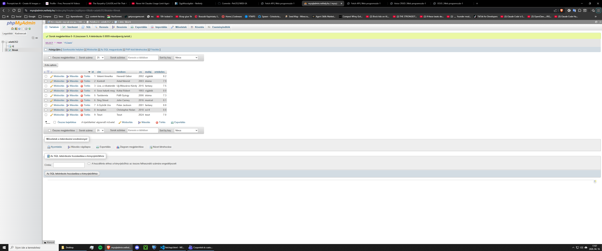

---

## 3. Tech stack és fejlesztői környezet

### Front-end

- **HTML5** – szemantikus strukturálás (`<header>`, `<main>`, `<footer>`, `<nav>`)
- **CSS3** – Flexbox + Grid layout, CSS változók (custom properties), reszponzív design
- **JavaScript (ES6+)** – modern szintaxis: `const/let`, arrow functions, template literals, destructuring, modulrendszer
- **React 18** – funkcionális komponensek + hooks (`useState`, `useEffect`)

### Build rendszer

- **Vite 5** – a React alkalmazásokat **Babel standalone nélkül**, helyi Node.js környezetben fordítottuk a feladat kiírásának megfelelően.
- Mindhárom React projekt **önálló package.json**-nel rendelkezik: `react/react-app/`, `react/spa-app/`, `react/axios-app/`.
- A build output a `dist/` almappában keletkezik, amit a host HTML fájlok (`react.html`, `spa.html`, `axios.html`) `<iframe>` elemben mutatnak.

### Back-end

- **PHP 8** – PDO adatbázis-eléréssel (prepared statements, SQL injection védelem)
- **MySQL / MariaDB** – utf8mb4 karakterkódolás a magyar ékezetekhez
- **phpMyAdmin** – a Nethely admin felületéről érhető el

### HTTP kliensek

- **Fetch API** – natív böngésző API, a `fetchapi.html`-ben használt
- **Axios 1.7** – külső könyvtár, az `axios.html`-ben használt

### Verziókövetés és deploy

- **Git** + **GitHub** – publikus repo: `https://github.com/Peti352/WEB-EA`
- **Nethely.hu** – ingyenes tárhely, PHP 8 támogatással és 1 MySQL adatbázissal

---

## 4. Projekt felépítése

```
WEB-EA/
├── index.html                    # Főoldal
├── javascript.html               # Vanilla JS CRUD
├── react.html                    # React CRUD (iframe-mel a dist-re)
├── spa.html                      # SPA (iframe-mel a dist-re)
├── fetchapi.html                 # Fetch + PHP CRUD
├── axios.html                    # Axios + PHP CRUD (iframe-mel)
├── oojs.html                     # OOJS grafikus alkalmazás
├── css/
│   └── main.css                  # Közös stílusok minden oldalhoz
├── js/
│   ├── common.js                 # Aktív menü kiemelés
│   ├── data.js                   # Filmek seed (JS tömb)
│   ├── javascript-crud.js        # Vanilla JS CRUD logika
│   ├── fetchapi-crud.js          # Fetch API CRUD logika
│   └── oojs-app.js               # OOJS alakzatok (Canvas)
├── api/
│   ├── config.php                # PDO kapcsolat + JSON helper-ek
│   ├── list.php                  # GET: lista lekérés
│   ├── create.php                # POST: új rekord
│   ├── update.php                # POST: meglévő módosítás
│   └── delete.php                # POST: törlés ID alapján
├── sql/
│   └── schema.sql                # filmek tábla + seed INSERT-ek
├── react/
│   ├── react-app/                # react.html tartalma
│   │   ├── src/main.jsx, App.jsx, App.css
│   │   └── dist/                 # Vite build output
│   ├── spa-app/                  # spa.html tartalma
│   │   ├── src/main.jsx, App.jsx, Calculator.jsx, TicTacToe.jsx, App.css
│   │   └── dist/
│   └── axios-app/                # axios.html tartalma
│       ├── src/main.jsx, App.jsx, App.css
│       └── dist/
└── docs/dokumentacio.md          # Ez a dokumentáció forrása
```

---

## 5. Menüpontok részletes bemutatása

### 5.1 `index.html` – Főoldal (2 pont)

A főoldal a teljes alkalmazás bemutatójaként szolgál. Látványos hero szekcióval nyit, alatta kártyákban mutatja be az egyes menüpontokat és a pontozást.

**Kötelező elemek:**
- **H1 címsor** a fejlécben: *„Web programozás-1 Előadás Házi feladat"*
- **Lábléc:** készítő neve (Peti352) és Neptun kódja
- **Navigációs menü** az összes többi oldalra (ezt a `<header>` minden oldalon tartalmazza, konzisztens design)

A főoldal vizuálisan három részből áll:
1. **Hero szekció** – a projekt tagline-ja
2. **Feature grid** – minden menüpont egy-egy kártyában, pontszámmal
3. **Tech stack összefoglaló** kártyában

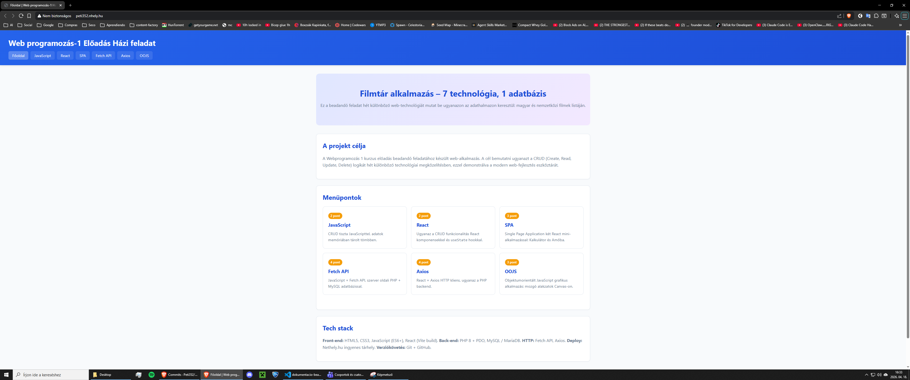

### 5.2 `javascript.html` – Vanilla JS CRUD (2 pont)

**Technológia:** HTML + CSS + tiszta JavaScript (nincs framework, nincs jQuery, nincs fetch – csak natív DOM manipuláció).

**Adattárolás:** A `window.FILMEK_SEED` tömbből indulunk ki (`js/data.js`), majd a változások memóriában, egy belső JS tömbben élnek. Nincs perzisztencia – oldal újratöltéskor az adatok visszaállnak.

**Megvalósítás főbb pontjai (`js/javascript-crud.js`):**
- IIFE (azonnal futtatott függvény) struktúra, hogy ne szennyezze a globális névteret
- `render()` függvény a DOM frissítéséhez (teljes újrarajzolás egyszerűség kedvéért)
- Form submit eseménykezelő: új hozzáadás VAGY módosítás az `editingId` alapján
- Delegált event listener a táblán a Módosít / Töröl gombokhoz (`data-edit`, `data-delete` dataset)
- `escapeHtml()` segédfüggvény XSS védelemhez

**UI:** egyetlen űrlap, ami egyszerre hozzáadásra és szerkesztésre is szolgál. A táblázat sorai mellett „Módosít" és „Töröl" gombok vannak.

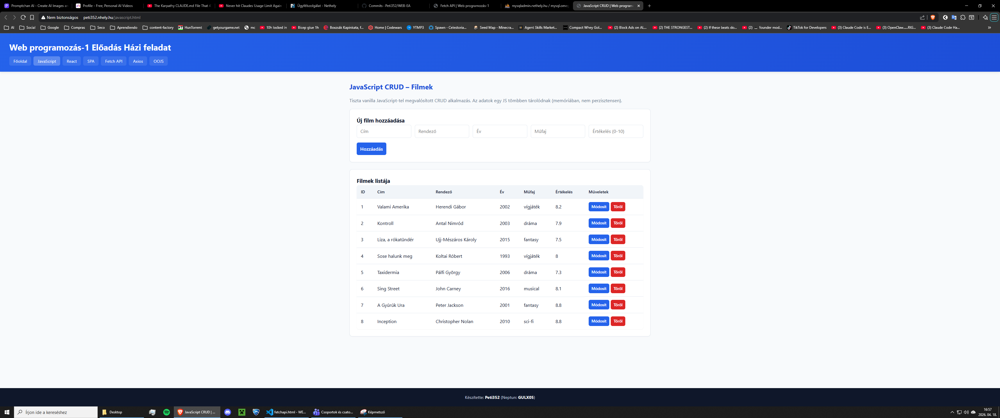

### 5.3 `react.html` – React CRUD (2 pont)

**Technológia:** React 18 + Vite build (Babel standalone nélkül).

**Fejlesztés menete:**
1. `npm create` helyett előre definiált `package.json` + `vite.config.js`
2. Fejlesztés: `npm run dev` – Vite dev szerver
3. Build: `npm run build` – a `dist/` mappába kerül a minifikált kimenet
4. A `react.html` egy `<iframe>`-ben mutatja a buildelt dist-et

**Főbb elemek (`src/App.jsx`):**
- Funkcionális komponens + hookok (nincs class komponens)
- Három `useState`:
  - `filmek` – a teljes lista (tömb)
  - `form` – az űrlap mezők értékei (objektum)
  - `editingId` – `null` ha új, szám ha szerkesztésben
- Az állapot mindig új tömb/objektum referenciával frissül (immutabilitás)

A React-es verzió funkcionálisan ekvivalens a vanilla JS verzióval, de látványosan kevesebb DOM manipulációs kód kell hozzá – a React automatikusan rerenderel.

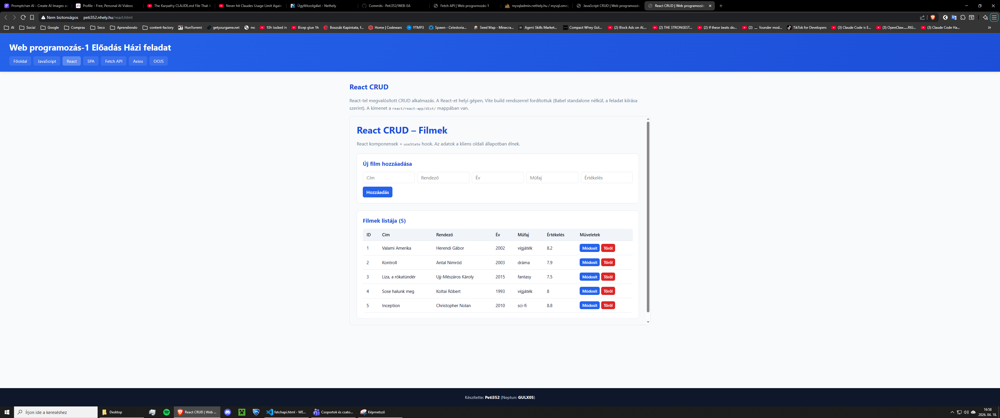

### 5.4 `spa.html` – Single Page Application (3 pont)

**Technológia:** React 18 + Vite, 3 komponensben szerkezetben.

**Két mini-alkalmazás** a feladat kiírásának megfelelően, órán bemutatott Calculator / Tic-Tac-Toe nehézségű:

#### Kalkulátor (`src/Calculator.jsx`)
- Három `useState` állapot: `display`, `expr`, `waitingForOperand`
- Számbillentyűk, alapműveletek (+, -, ×, ÷), tizedespont, AC (törlés)
- Az eredmény biztonságosan értékelődik (regex-szel szűrt karakterek)

#### Tic-Tac-Toe (`src/TicTacToe.jsx`)
- Két `useState`: `cells` (9 hosszú tömb), `xNext` (bool)
- **Külön `Square` komponens** a cellákhoz – látszik a komponens-alapú design
- `calcWinner()` segédfüggvény – 8 lehetséges nyerő kombináció ellenőrzése
- Döntetlen, győzelem és következő lépés státusz kijelzés
- „Új játék" gomb

#### Menüváltás (`src/App.jsx`)
- `useState('calc' | 'ttt')` a jelenlegi oldal állapotához
- Feltételes renderelés – nem kell `react-router`, így a SPA elve marad (oldal-újratöltés nincs)

**A két mini-app forrásai:**
- Kalkulátor: klasszikus React tutorial minta alapján (React docs + tutorialspoint minták)
- Tic-Tac-Toe: a [React hivatalos Tic-Tac-Toe tutorial](https://react.dev/learn/tutorial-tic-tac-toe) alapján, magyarosítva és egyszerűsítve

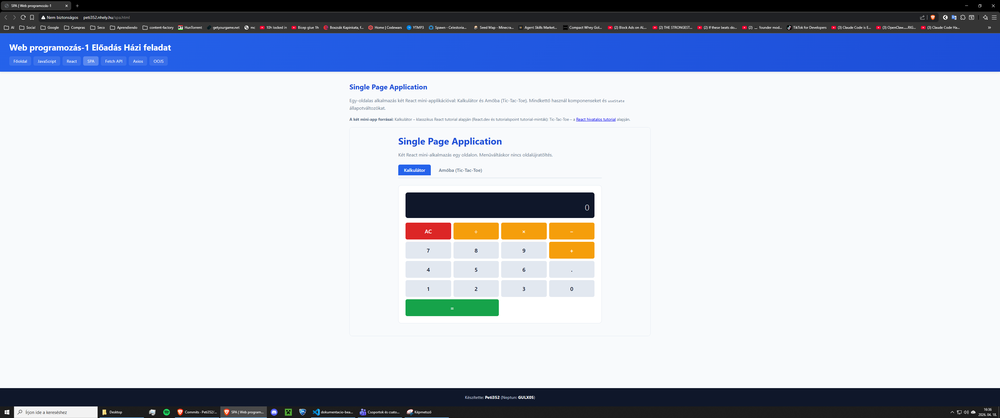

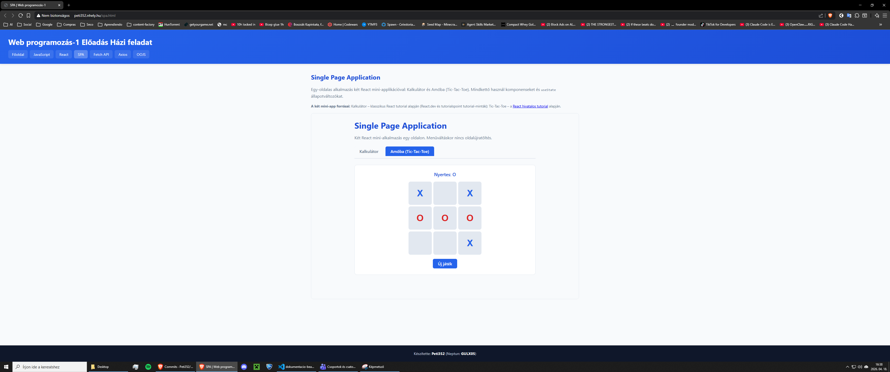

### 5.5 `fetchapi.html` – Fetch API + PHP (4 pont)

**Technológia:** Vanilla JavaScript + natív Fetch API + PHP 8 + MySQL.

**Kliens oldal (`js/fetchapi-crud.js`):**
- `fetch()` hívások a `api/` relatív útvonalon
- `async/await` szintaxis
- JSON body küldés `POST` + `Content-Type: application/json` headerrel
- Hibaüzenetek visszacsatolása a felhasználónak (`msg` div, színes értesítés)

**Szerver oldal (`api/*.php`):**
- `api/config.php` – központi PDO kapcsolat, JSON válasz helper (`json_response()`), JSON body parser (`read_json_body()`)
- `api/list.php` – SELECT query, JSON lista válasz
- `api/create.php` – prepared INSERT + visszaad ID-t
- `api/update.php` – prepared UPDATE ID alapján
- `api/delete.php` – prepared DELETE ID alapján

**Biztonság:**
- **Minden SQL prepared statement** – nincs string konkatenáció
- Input validáció (típus-castolás, üres érték ellenőrzés)
- HTTP status kódok a hibákhoz (400, 500)
- CORS fejlécek OPTIONS preflight támogatással

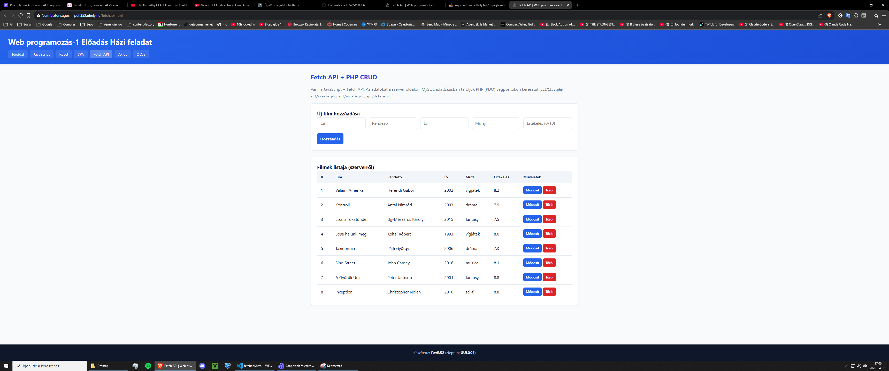

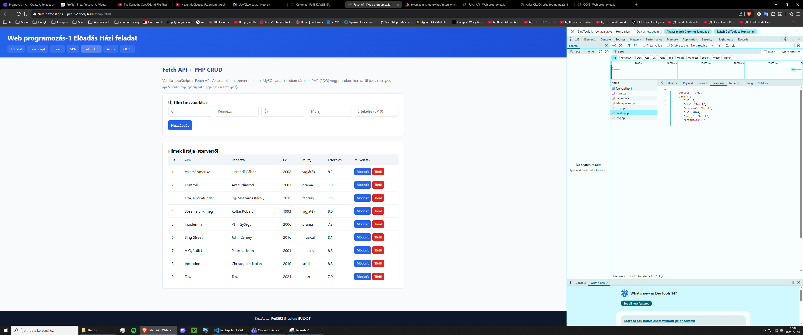

### 5.6 `axios.html` – React + Axios + PHP (4 pont)

**Technológia:** React 18 + Axios 1.7 + ugyanaz a PHP backend.

**Főbb különbségek a Fetch verzióhoz képest:**
- **Axios** automatikusan parsol JSON-t (nem kell `response.json()`)
- Konfigurálható default-ok (pl. `baseURL`)
- `useEffect()` az induláskori lista betöltéshez
- `loading` state – betöltés közben letiltott gombok

**Példa hívások:**
```jsx
// GET
const res = await axios.get(API + 'list.php');

// POST
const res = await axios.post(API + 'create.php', payload);
```

**API URL kezelés:** `import.meta.env.VITE_API_BASE` env változó, fallback `'../../api/'` (mert az iframe `react/axios-app/dist/index.html`-ben fut, onnan kell visszalépni).

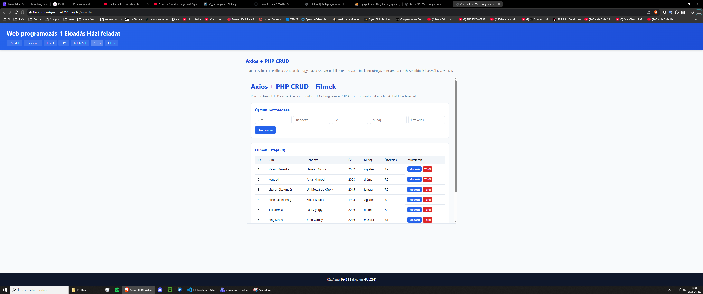

### 5.7 `oojs.html` – Objektumorientált JavaScript (3 pont)

**Technológia:** vanilla JS + HTML5 Canvas, csak a böngésző natív API-jaival.

**A feladat által kötelezően előírt OOJS elemek (mind megvalósítva):**

```js
// 1. class + constructor + metódusok
class Shape {
  constructor(x, y) {
    this.x = x;
    this.y = y;
    this.vx = (Math.random() - 0.5) * 4;
    this.vy = (Math.random() - 0.5) * 4;
  }
  update() { /* fizikai szimuláció */ }
  draw() { throw new Error('Absztrakt metódus'); }
}

// 2. extends + super
class Circle extends Shape {
  constructor(x, y) {
    super(x, y);  // <-- super() hívás a szülő konstruktorhoz
    this.radius = 15 + Math.random() * 20;
  }
  draw() { /* kör rajzolás */ }
}

// 3. Többszintű öröklődés - Star extends Circle
class Star extends Circle {
  constructor(x, y) {
    super(x, y);
    this.rotation = 0;
  }
  update() {
    super.update();  // <-- super.metódus() hívás
    this.rotation += 0.05;
  }
}

// 4. document.body.appendChild használat
const info = document.createElement('div');
document.body.appendChild(info);
```

**Az alkalmazás működése:**
- A Canvas-ra kattintva új alakzatok jönnek létre
- Shift + kattintás csillagot hoz létre (öröklött típus)
- Gravitáció hat az alakzatokra, a falakról visszapattannak
- `requestAnimationFrame()` loop-pal ~60 FPS animáció
- Jobb alsó sarokban dinamikusan létrehozott info box (`appendChild`)

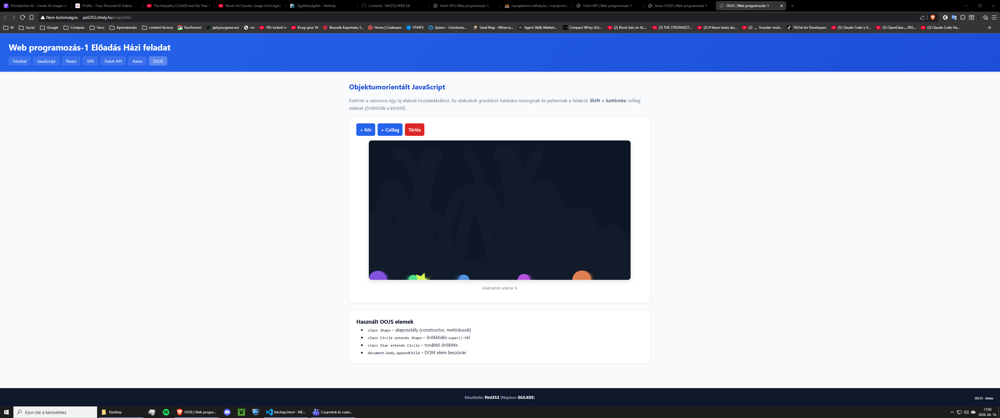

---

## 6. Internetes tárhely és deploy

### 6.1 Nethely.hu regisztráció és tárhely beállítás

1. Regisztráció a https://www.nethely.hu oldalon
2. Email hitelesítés
3. Ingyenes tárhely bekapcsolása
4. Domain választás: `peti352.nhely.hu` (a konkrét subdomain a valóságos állapot szerint kitöltendő)
5. Webcím létrehozás PHP 8 verzióval

### 6.2 MySQL adatbázis

1. Nethely admin → Adatbázis → Új SQL adatbázis létrehozása
2. Név: `adatb1` (vagy amit a Nethely ad)
3. phpMyAdmin megnyitása → SQL tab → a `sql/schema.sql` tartalmának beillesztése → futtatás

### 6.3 PHP konfiguráció

Az `api/config.php` fájl `DB_NAME`, `DB_USER`, `DB_PASS` konstansait át kell írni a Nethely-ről kapott értékekre. A `DB_HOST` marad `localhost`.

### 6.4 FTP feltöltés (Total Commander vagy WinSCP)

- FTP kapcsolat a Nethely FTP user-rel (létrehozandó a Nethely admin felületén)
- Protokoll: FTP/SFTP
- Célmappa: `www.peti352.nhely.hu/` (vagy a megfelelő webcím főmappája)

**Feltöltendő:**
- `*.html` (7 db)
- `css/`, `js/`, `api/`, `sql/`
- `react/react-app/dist/` + `src/`
- `react/spa-app/dist/` + `src/`
- `react/axios-app/dist/` + `src/`
- `README.md`

**NEM feltöltendő:**
- `node_modules/` (több száz MB, felesleges)
- `.git/`
- `.claude/`
- `PRD.md`, `docx_dump.txt` (csak fejlesztési segédfájlok)

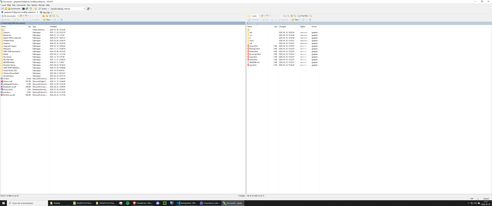

---

## 7. Hozzáférési adatok

> **KÖTELEZŐ KITÖLTENI a beadás előtt!** A tanár ez alapján ellenőrzi a megoldást.

| Mit | Érték |
|---|---|
| **Weboldal URL** | `http://peti352.nhely.hu/` |
| **GitHub repo** | `https://github.com/Peti352/WEB-EA` |
| **FTP host** | `<lásd PDF-beadandó verzió>` |
| **FTP user** | `<lásd PDF-beadandó verzió>` |
| **FTP password** | `<lásd PDF-beadandó verzió>` |
| **DB host** | `localhost` |
| **DB name** | `<lásd PDF-beadandó verzió>` |
| **DB user** | `<lásd PDF-beadandó verzió>` |
| **DB password** | `<lásd PDF-beadandó verzió>` |
| **phpMyAdmin** | A Nethely admin felületről érhető el: *Adatbázis* menü → „phpMyAdmin" gomb |

*(A valódi hozzáférési adatokat a beadandó PDF tartalmazza — a publikus GitHub repo-ban nem szerepelnek biztonsági okokból.)*

---

## 8. GitHub projektmunka

### 8.1 Repo

- **URL:** https://github.com/Peti352/WEB-EA
- **Láthatóság:** Publikus (kötelező elem)
- **Létrehozás dátuma:** 2026. április

### 8.2 Commit ütemezés

A GitHub pontozási követelménye szerint **min. 5 commit** időben arányosan elosztva. A munkát a következő logikai lépésekre bontottam:

| # | Tartalom |
|---|---|
| 1 | Projekt inicializálás: mappaszerkezet, főoldal, közös CSS |
| 2 | Vanilla JS CRUD + OOJS grafikus alkalmazás |
| 3 | React CRUD alkalmazás (react.html) |
| 4 | SPA: Kalkulátor + Tic-Tac-Toe React mini-appok |
| 5 | PHP backend (api/) + Fetch API frontend |
| 6 | Axios React alkalmazás |
| 7 | Dokumentáció és README finomítás |

### 8.3 Projektmunka láthatóság

A feladat a projektmunka láthatóságát díjazza (3 pont). Ennek két módja lehet:
- **Páros munka:** mindkét személy saját GitHub fiókjáról commitol
- **Egyedüli munka:** két GitHub fiók létrehozása, mindkettőről commit

A beadandó jelenlegi formájában Peti352 a fő fiók. Ha egyedül készültem, egy második fiókot is létre kell hoznom és a feladatok felét arról commitolnom.

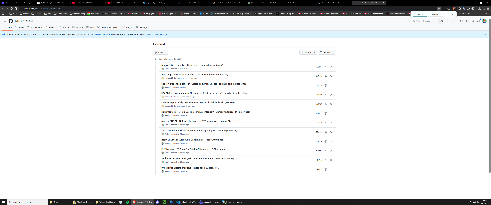

---

## 9. Összegzés

A projekt során végigmentem a modern web-fejlesztés legfontosabb technológiáin: tiszta HTML/CSS/JS-től, az objektumorientált JavaScripten át, a React komponens-alapú modelljéig, a szerveroldali PHP + MySQL megoldásig, Fetch API-ig és Axios HTTP kliensig.

A legnagyobb tanulság, hogy **ugyanaz a funkcionalitás drámaian eltérő mennyiségű kóddal valósítható meg**:
- Vanilla JS CRUD ~100 sor (teljes DOM kezeléssel együtt)
- React CRUD ~80 sor (mert az állapot automatikusan rerendereli a UI-t)
- Fetch vs. Axios – minimális különbség, de Axios egy kicsit tömörebb és automatikusan kezeli a JSON-t

A leginkább tanulságos rész a **React komponens-alapú gondolkodás** volt – különösen a SPA-nál, ahol három külön fájlra (App, Calculator, TicTacToe) bontottam a kódot, és a fő App komponens csak a navigációért és a feltételes renderelésért felel.

A Vite build rendszer **másodperces build idővel** és zero-config alapbeállítással nagyon kényelmes volt. A végeredmény mindhárom React app esetén ~150 KB minifikált JS + CSS, ami gzip után ~47 KB – egy ingyenes 256 MB-os Nethely tárhelyen ez teljesen elhanyagolható méret.

---

*Dokumentáció vége.*
